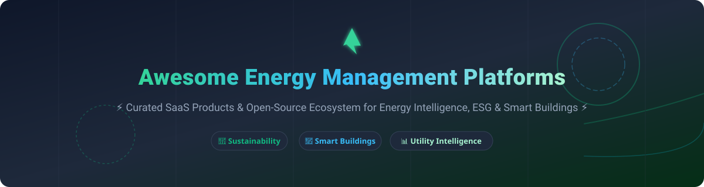

# ⚡ Awesome Energy Management Platform Ecosystem ⚡

  
  
  
  
  

> 🌐 **A comprehensive, SEO-optimized, curated guide to Enterprise SaaS Energy Management Systems (EMS), Smart Building Automation software, ESG Sustainability reporting platforms, and Open-Source Energy Data Frameworks.**  
> 💡 *Designed for Facility Managers, Chief Sustainability Officers (CSOs), Energy Engineers, and Smart Building Operations Teams to optimize utility bills, track Scope 1-3 carbon emissions, and deploy IoT telemetry pipelines.*  
> 📅 **Last Updated: September 2026**

---

## 📑 Table of Contents
- [📊 SaaS & Hosted Energy Management Platforms](#-saas--hosted-energy-management-platforms)
- [🔓 Open-Source GitHub Projects & Frameworks](#-open-source-github-projects--frameworks)
- [🛠️ Recommended Architecture & Tech Stack](#%EF%B8%8F-recommended-architecture--tech-stack)
- [🤝 How to Contribute](#-how-to-contribute)
- [💖 Support & Sponsorship](#-support--sponsorship)
- [⚠️ Disclaimer](#%EF%B8%8F-disclaimer)
- [📈 Star History](#-star-history)

---

## 📊 SaaS & Hosted Energy Management Platforms

> 💡 **Market Size & Industry Structure:**  
> The global **Energy Management Systems (EMS) software market** is estimated at **$42.8 Billion in 2026** and is projected to reach **$85+ Billion by 2032** (CAGR ~12.2%), propelled by global Net-Zero regulatory mandates (such as CSRD and California Climate Disclosure Acts) and commercial building electrification. The market is **moderately fragmented**, with legacy industrial conglomerates (Schneider Electric, Siemens, Honeywell) competing alongside high-growth vertical SaaS platforms (Measurabl, EnergyCAP, GridPoint) and specialized AI optimization engines (BrainBox AI).

Below is a tabular overview of top commercial SaaS energy management platforms sorted by **Company Size / Revenue / Valuation** (descending):

| Product 🏢 | Description 📝 | Company Size / Revenue / Valuation 💰 | Starting Pricing 🏷️ | Free Tier / Trial Limit ⏱️ |
| :--- | :--- | :--- | :--- | :--- |
| **[Schneider EcoStruxure Resource Advisor](https://www.se.com/)** | Enterprise-grade energy, water, waste, and ESG carbon data platform centralizing 400+ data streams with AI-driven analytics. | Enterprise Subsidiary (~$38B parent revenue; Schneider Electric) | $1,200 / month starting base tier | 14-day enterprise trial (guided demo sandbox limit) |
| **[BrainBox AI](https://www.tranetechnologies.com/)** | Autonomous AI building energy management engine optimizing HVAC operations in real-time to lower energy costs by 25-40%. | Division of Trane Technologies (~$18B revenue parent; Acquired 2024) | $800 / month base building connection | 30-day simulated HVAC efficiency audit trial |
| **[Measurabl](https://www.measurabl.de/)** | Commercial real estate ESG & sustainability data platform supporting GRESB, CDP, and S&P Global independent verification. | Series C ($130M+ total funding; $500M+ valuation) | $500 / month starting tier (up to 5 buildings) | 14-day full portfolio preview & data gap check |
| **[GridPoint](https://www.gridpoint.com/)** | Commercial building energy management system integrating HVAC controls, submetering, and grid demand response. | Growth Enterprise ($150M+ capital raised; ~$50M+ ARR) | $350 / month (Energy-Management-as-a-Service model) | 30-day proof-of-concept trial (1 pilot site) |
| **[WatchWire](https://info.watchwire.ai/)** | Energy and sustainability management solution by Tango Analytics offering utility bill auditing, interval data, and carbon tracking. | Acquired by Tango ($40M+ ARR platform parent) | $300 / month per facility starting tier | 14-day full platform access free trial |
| **[Dexma by Spacewell](https://www.dexma.com/)** | Energy intelligence platform supporting 150+ data sources, real-time telemetry, and M&V projects for ESCOs and facility teams. | Acquired by Nemetschek Group (~$850M revenue parent) | €250 / month base subscription | 21-day free trial (up to 10 meter data streams) |
| **[EnergyCAP](https://www.energycap.com/)** | Utility bill processing, automated auditing, cost allocation, and energy benchmarking tracking >$100B in cumulative bills. | Private Equity Backed (Resurgens Tech Partners; ~$30M ARR) | $200 / month base tier (up to 25 utility accounts) | 14-day interactive trial account |
| **[Enertiv](https://www.enertiv.com/)** | Commercial real estate IoT & energy management software providing submetering, tenant billing, and equipment fault detection. | Series A ($15M+ total venture funding) | $150 / month per building asset tier | 30-day trial with sample building sensor datasets |
| **[Verdigris](https://verdigris.co/)** | AI-powered non-intrusive electrical load monitoring and high-frequency circuit submetering platform. | Venture Backed ($22M+ funding; ~100k circuits tracked) | $120 / month per panel gateway connection | 14-day cloud dashboard trial with sample IoT streams |
| **[Energy Elephant](https://energyelephant.com/)** | Cloud utility management platform centralizing electricity, gas, water, smart meter data, and Scope 3 carbon reporting. | Bootstrap / Scaleup (~$5M ARR; global portfolio footprint) | €49 / month starter tier (up to 5 sites) | 14-day unrestricted free trial (up to 3 sites) |

---

## 🔓 Open-Source GitHub Projects & Frameworks

Explore top open-source projects for self-hosting energy telemetry, smart building control, home automation, and time-series metrics. Listed in descending order of **GitHub Stars**:

1.  **[Home Assistant](https://github.com/home-assistant/core)**  
   *Open-source home automation and localized energy management platform putting privacy and local control first. Features comprehensive energy dashboards, solar PV integration, grid export tracking, and battery storage monitoring.*

2.  **[Netdata](https://github.com/netdata/netdata)**  
   *Real-time performance, energy, and infrastructure monitoring agent designed to collect granular metrics (including power consumption, thermals, and UPS battery telemetry) with zero configuration.*

3.  **[ThingsBoard](https://github.com/thingsboard/thingsboard)**  
   *Open-source IoT platform for data collection, processing, visualization, and device management. Widely deployed for smart building energy monitoring, smart metering telemetry, and HVAC control.*

4.  **[EVCC](https://github.com/evcc-io/evcc)**  
   *Extensible EV Charge Controller with photovoltaics (PV) energy integration. Optimizes electric vehicle charging using self-generated solar energy and dynamic energy tariffs.*

5.  **[OpenEMS (Open Energy Management System)](https://github.com/OpenEMS/openems)**  
   *Modular open-source energy management framework initiated by FENECON. Controls energy storage systems (ESS), EV chargers, heat pumps, and PV inverters via OpenEMS Edge and aggregates telemetry in OpenEMS Backend.*

6.  **[ioBroker](https://github.com/ioBroker/ioBroker)**  
   *Modular IoT integration platform for smart homes and commercial facilities, offering extensive adapters for smart meters, power submeters, and energy dashboards.*

7.  **[openHAB](https://github.com/openhab/openhab-core)**  
   *Vendor-agnostic smart home and building automation engine focusing on local device interoperability and energy usage automation.*

8.  **[VOLTTRON](https://github.com/VOLTTRON/volttron)**  
   *US Department of Energy (PNNL) open-source agent execution platform for building energy management, smart grid integration, and transactional energy applications.*

9.  **[ecosysnc](https://github.com/kimdain0222/ecosysnc)**  
   *Smart Building Energy Management System (SBEMS) using FastAPI and React to run vacancy prediction models for HVAC and lighting energy reduction.*

10.  **[Smart Building IIoT Framework](https://github.com/hashiniWijerathne/e17-co326-Smart-Building)**  
    *MQTT and SCADA smart building automation framework integrating ESP32/Arduino microcontrollers with open-source analytics.*

---

## 🛠️ Recommended Architecture & Tech Stack

To build a custom enterprise-grade energy management architecture:
* 🔌 **Telemetry & Edge Ingestion:** [OpenEMS](https://github.com/OpenEMS/openems) / [ThingsBoard](https://github.com/thingsboard/thingsboard) / MQTT Brokers (Mosquitto)
* 💾 **Time-Series Storage:** PostgreSQL + TimescaleDB / InfluxDB
* 📊 **Dashboards & Alerting:** Grafana / Home Assistant Energy Panel
* 🧠 **Analytics & Machine Learning:** Python (Pandas, Prophet, Scikit-learn) for peak load forecasting and fault detection

---

## 🤝 How to Contribute

Contributions are warmly welcome! Help us keep this directory accurate and comprehensive:
1. 🍴 **Fork** this repository.
2. ✏️ **Update** `README.md` following the standard table/list formats.
3. 🔍 Ensure product descriptions, pricing, and GitHub links are factual.
4. 📬 Submit a **Pull Request (PR)** with a clear summary of your changes.

Check out our curated meta-list at **[Awesome-Awesome-Awesome](https://github.com/ishandutta2007/Awesome-Awesome-Awesome)** for more curated developer resources!

---

## 💖 Support & Sponsorship

If you found this energy management repository helpful, please consider supporting the project:
* ⭐ **Star** this repository to increase its visibility.
* 🔀 **Fork** and share it with facility managers and energy engineers.
* ☕ **Buy Me a Coffee / Sponsor:** Support ongoing maintenance via the [GitHub Sponsor Dashboard](https://github.com/sponsors/ishandutta2007).

---

## ⚠️ Disclaimer

- This list is **community-curated** for informational and educational purposes.
- Always review compliance regulations (GDPR, ISO 50001, ASHRAE) when handling utility and building IoT data.

---

## 📈 Star History

