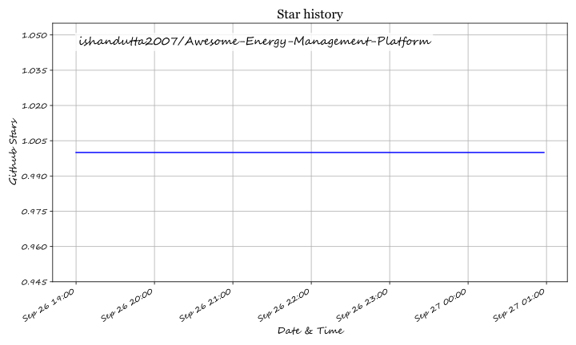

# Awesome Energy Management Platform Ecosystem

**A curated list of SaaS products and open-source GitHub projects in the energy management domain.**  
*Focusing on utility bill management, energy intelligence, building automation, and sustainability reporting.*  
**Last Updated: September 2026**

This repository tracks prominent **SaaS platforms** and **open-source projects** in the field of **energy management**. These tools assist facility managers, energy managers, and sustainability teams in centralizing utility bills, monitoring energy consumption, optimizing building operations, and reporting carbon emission data.

**Examples** include EnergyCAP, Dexma by Spacewell, GridPoint, Enertiv, WatchWire, Schneider EcoStruxure Resource Advisor, Measurabl, Verdigris, BrainBox AI, and Energy Elephant.

**Open Source Focus**: This list highlights active projects for self-hosting, custom data pipelines, and transparent energy data management—ideal for facility teams and energy managers who want full control over their utility and sustainability data without expensive SaaS subscription limits.

Contributions welcome! Submit a PR to add/update entries. Keep descriptions factual and link to official sites.

---

## Table of Contents

- [SaaS / Hosted Platforms](#saas--hosted-platforms)
- [Open Source GitHub Projects](#open-source-github-projects)
- [How to Contribute](#how-to-contribute)
- [Disclaimer](#disclaimer)

---

## SaaS / Hosted Platforms

| Product | Description | Pricing & Limits |
| :--- | :--- | :--- |
| **[EnergyCAP](https://www.energycap.com/)** | Utility bill management and energy management platform serving for over 40 years. Centralizes electricity, gas, water, and sewer data with automated bill auditing, cost allocation, budgeting, and benchmarking. Serves 26,000+ users tracking >$100B in annual bills. | Custom quote / Enterprise. Contact sales. Free demo available. |
| **[Dexma by Spacewell](https://www.dexma.com/)** | Energy intelligence platform helping ESCOs, utility providers, and large enterprises optimize energy efficiency. Supports 150+ data sources, real-time monitoring, cost allocation, benchmarking, and automated reporting. Joined Spacewell (Nemetschek Group) in 2020. | Subscription-based (per meter/data source). Contact sales for tier details. |
| **[GridPoint](https://www.gridpoint.com/)** | Commercial building energy management system connecting buildings, enterprises, and the grid. Analyzes HVAC and lighting data to optimize energy usage, lower costs, and reduce carbon emissions. | Energy-Management-as-a-Service (subscription/no upfront CAPEX option). Contact sales. |
| **[Enertiv](https://www.enertiv.com/)** | AI-driven commercial real estate energy management platform. Offers utility data capture/validation, equipment-level monitoring, tenant billing, carbon planning, and preventive maintenance solutions. | Custom enterprise quote based on portfolio square footage / equipment count. |
| **[WatchWire](https://info.watchwire.ai/)** | Sustainability and energy management software (acquired by Tango Analytics in 2023). Tracks energy, water, waste, and emissions data, offering APIs, M&V project management, budgeting, and bill simulation. | Custom pricing based on building size and modules required. Free demo. |
| **[Schneider EcoStruxure Resource Advisor](https://www.se.com/)** | Enterprise-grade energy and sustainability data platform by Schneider Electric. Centralizes 400+ data streams to manage energy procurement, carbon emissions, utility bills, and ESG reporting with AI-driven Copilot analysis. | Enterprise pricing based on data streams and active modules. Contact sales. |
| **[Measurabl](https://www.measurabl.de/)** | Real estate ESG data management platform. Partners with S&P Global for independent ESG verification, supports GRESB reporting, and integrates utility data (PG&E, PERSE, etc.) with automatic data gap detection. | Custom subscription based on portfolio size and ESG framework support. |
| **[Verdigris](https://verdigris.co/)** | AI-powered building energy monitoring platform. Uses proprietary hardware and software to identify equipment signatures, detect faults, and optimize peak demand via non-intrusive load disaggregation. | Hardware + SaaS subscription bundle. Custom quote per electrical panel / building. |
| **[BrainBox AI](https://www.tranetechnologies.com/)** | Autonomous AI building energy management solution (acquired by Trane Technologies). Continuously optimizes HVAC systems using AI, achieving energy reductions up to 25-40%. | Subscription-based (pay-as-you-save / SaaS model). Contact sales. |
| **[Energy Elephant](https://energyelephant.com/)** | Energy management tool for multinational companies and supply chains. Centralizes utility bills, smart meters, and sensor data to manage remote workforce and Scope 3 emissions. Supports TCFD, CDP, and ISO 50001 reporting. | Tiered subscription based on number of sites/meters. Free trial available. |

---

## Open Source GitHub Projects

- **[OpenEMS](https://github.com/OpenEMS/openems)**  
  Open-source Energy Management System driven by the OpenEMS Association and initiated by FENECON GmbH. Features a modular architecture supporting fast PLC-level device control, reusable hardware-agnostic algorithms, and broad protocol support. Includes OpenEMS Edge (on-site device control) and OpenEMS Backend (cloud aggregation/monitoring). *License: Eclipse Public License 2.0*.

- **[ecosysnc](https://github.com/kimdain0222/ecosysnc)**  
  Smart Building Energy Management System (SBEMS) project. Analyzes building electricity usage data and implements vacancy prediction models to automatically control lighting and HVAC when spaces are unoccupied. Tech stack: React.js frontend, FastAPI backend, PostgreSQL database, Python ML pipeline.

- **[Smart Building IIoT Framework](https://github.com/hashiniWijerathne/e17-co326-Smart-Building)**  
  Smart building framework based on MQTT and SCADA. Covers HVAC, lighting, security, energy usage, occupancy control, PV integration, and overall control systems using Mosquitto MQTT Broker, Arduino/ESP32 devices, and open-source SCADA/analytics platforms.

- **[SustainML](https://github.com/SustainML/SustainML)**  
  Sustainable Machine Learning framework for building energy efficiency and sustainability ML applications.

### Recommended Stack for Custom Systems

To build a custom energy management system, combine:
- **[OpenEMS](https://github.com/OpenEMS/openems)** for device-level control and data aggregation.
- **ecosysnc** or **Smart Building IIoT Framework** for building-level monitoring.
- **PostgreSQL + TimescaleDB** for time-series data storage.
- **Grafana** for dashboard visualizations.
- **Mosquitto MQTT** for hardware/device communication and **FastAPI** for API layers.

---

## How to Contribute

1. Fork the repository.
2. Add or edit entries in `README.md` (following the existing format).
3. Include: Name, Link, 1-2 sentence description, and whether it is SaaS or Open Source.
4. Submit a Pull Request with a clear summary of your changes.

If you find this repository helpful, please consider giving it a ⭐!

---

## Disclaimer

- This is a **community-curated** list—it is neither exhaustive nor an official endorsement.
- Energy management platforms process sensitive utility and sustainability data; ensure compliance with applicable data protection and privacy regulations.
- Self-hosted open-source solutions require proper security hardening, data pipeline maintenance, and regular security audits.

---

**Built for Facility Managers, Energy Managers, Sustainability Officers, and Building Operations Teams.**  
*Making energy management more open, transparent, and efficient.*

## ⭐ Star History

<a href="https://star-history.com/#ishandutta2007/Awesome-Energy-Management-Platform&Timeline" align="center">
  <picture>
    <source media="(prefers-color-scheme: dark)" srcset="assets/ishandutta2007_Awesome-Energy-Management-Platform_growth.svg">
    
  </picture>
</a>
